# 一、GIS开发期末大作业 · BUG修复

（基于C#的ArcEngine桌面开发）

> **Created By:** 肖容千
> **Date:** 2026.1.1
---

## Bug修复

### 1.  解决了因未导入数据在`axMapControl2`上进行鼠标移动导致的空引用报错的问题

**1）主要思路**：加入一个`if判断`防止空引用报错。

**2）核心代码**：
``` C#
if (pEnv == null || pEnv.IsEmpty)
{
    axMapControl2.MousePointer = esriControlsMousePointer.esriPointerDefault;
    return;
}
```

---

### 2.  解决了加载`栅格数据`、`SHP数据`、`个人地理数据库数据`无法将其同步在鹰眼控件的问题

**1）主要思路**：在数据加载完成后立即调用鹰眼同步方法，确保概览图刷新;更新 `Synchronize_axMapControl2`，显式支持 `IRasterLayer` 并对要素图层做空值与类型判断，避免因栅格或空要素类导致概览图不同步或空引用。

**2）核心代码**：
``` C#
// 同步鹰眼控件显示栅格图层
Synchronize_axMapControl2();

if (pSubLayer is IRasterLayer)
{
    axMapControl2.AddLayer(pSubLayer);
    continue;
}

```

---

### 3.  解决了加载`TXT文本数据`无法将其同步在鹰眼控件的问题

**1）主要思路**：在 TXT 数据生成并加载到主地图时触发一个“图层已创建”事件；主窗体在打开 TXT 对话框时订阅该事件，并在事件触发时调用现有的 `Synchronize_axMapControl2()`，以完成鹰眼范围与图层的同步。订阅处理为一次性回调，避免重复绑定。

**2）核心代码**：
``` C#
private void 加载TXT文本数据ToolStripMenuItem_Click(object sender, EventArgs e)
{
    FormAddTxt fat = new FormAddTxt();
    fat.BuddyMap = axMapControl1;

    EventHandler syncHandler = null;
    syncHandler = (s, args) =>
    {
        Synchronize_axMapControl2();
        fat.LayerCreated -= syncHandler;
    };
    fat.LayerCreated += syncHandler;

    fat.Show();
}
// 在FormAddTxt.cs中新增事件声明
public event EventHandler LayerCreated;
// 在buuton3_click（创建按钮）事件中订阅LayerCreated事件
EventHandler handler = LayerCreated;
if (handler != null)
{
    handler(this, EventArgs.Empty);
}

```
-   1）因为在鹰眼控件上原本只允许显示线面图层，明确排除了点和多点因此还需更改if判断允许点图层也加入。

**2）核心代码**：
``` C#
if (pFeatureLayer != null && pFeatureLayer.FeatureClass != null)
{
    
}

```

---

### 4.  解决了在对`axMapControl1`中的数据进行编辑后(如移除图层、编辑要素)鹰眼控件上无法同步的问题

**1）主要思路**：在移除图层操作完成后主动调用鹰眼同步方法，确保概览图即时更新。在保存编辑和结束编辑操作后，同步调用鹰眼刷新逻辑，使编辑结果直接反映到`axMapControl2`。即在各个操作后加同步代码。

**2）核心代码**：
``` C#
// 移除图层后同步鹰眼控件
Synchronize_axMapControl2();
```

---

### 5.  解决了加载文件地理数据库数据时，`axTOCControl1`会显示图层信息，但是`axMapControl`1和`axMapControl2`里不显示地图，同时整个窗体会卡死，只可以通过在VS里结束编译停止运行的问题

**1）主要思路**：修正要素数据集子集遍历的循环条件，使用子集枚举变量控制循环终止，避免死循环，确保图层正常添加并刷新到主图和鹰眼。

**2）核心代码**：
``` C#
while (pDataset1 != null)
{

}
```
>   `其实我觉得这里应该是我当时代码敲错了🤡....`

---

### 6.  解决了多次加载不同数据类型的文件时不会将原来显示在`axMapControl`1和`axMapControl2`的地图覆盖的问题

**1）主要思路**：修改`ClearAllData（）`，在`shapefile`工作空间加载、`AddShapeFile`加载、栅格加载前调用`ClearAllData()`。

**2）核心代码**：
``` C#

private void ClearAllData()
{
    ...
        // +
        axMapControl1.ActiveView.Refresh();
    }

    if (axMapControl2 != null)
    {
        axMapControl2.ClearLayers();
        IMap overviewMap = new MapClass();
        overviewMap.Name = "Overview";
        axMapControl2.Map = overviewMap;
        axMapControl2.ActiveView.Refresh();
    }
}

// +
ClearAllData();
```

**6.1但是这样改会导致原数据直接被清除，也是一个问题**

**1）主要思路**：
*   新增`ZoomToLayer（ILayer layer）`方法:在添加新图层后自动缩放至该图层，同时调用 `Synchronize_axMapControl2`，使新图层覆盖显示但旧图层仍可在`axTOCControl1`里切换可见性；
*   修改`加载MXD数据`和`FormAddTxt`的代码逻辑。

**2）核心代码**：
``` C#
        private void ZoomToLayer(ILayer layer)
        {
            if (layer == null)
            {
                return;
            }
            IEnvelope extent = layer.AreaOfInterest;
            if (extent != null && !extent.IsEmpty)
            {
                axMapControl1.Extent = extent;
                axMapControl1.ActiveView.Refresh();
                Synchronize_axMapControl2();
            }
        }
        // MXD
        if (axMapControl1.CheckMxFile(pFileName))
                {
                    ..
                    //// 获取Map中激活的地图
                    //axMapControl1.Map = pMapDocument.ActiveView.FocusMap;

                    // repair
                    IMap sourceMap = pMapDocument.ActiveView.FocusMap;
                    IMap targetMap = axMapControl1.Map;

                    for (int i = 0; i < sourceMap.LayerCount; i++)
                    {
                        ILayer layerToAdd = sourceMap.get_Layer(i);
                        targetMap.AddLayer(layerToAdd);
                    }
                    ...
                }
        // FormAddTxt
        else
        {
            ...
            // repair
            //IMap pMap = new MapClass();
            //pMap.Name = "Map";
            //buddyMap.DocumentFilename = string.Empty;
            //buddyMap.Map = pMap;
            if (buddyMap.Map == null)
            {
                IMap newMap = new MapClass();
                newMap.Name = "Map";
                buddyMap.Map = newMap;
            }
        }
```

---

### 7.  解决了加载多个数据源时新加载的地图无法成为`焦点图层`的问题。如：加载`栅格图层`再加载`MXD数据`，`axMapControl1`和`axMapControl2`中仍显示`栅格图层信息`

**1）主要思路**：在所有 MXD 加载入口中，将 MXD 图层追加到现有 Map 后，立即同步鹰眼并缩放到最新添加的图层，使最新数据成为当前视图焦点。若当前 Map 为空，先创建新的 Map，确保追加与刷新逻辑可执行。

**2）核心代码**：
``` C#
 // repair
//axMapControl1.ActiveView.Refresh();
Synchronize_axMapControl2();
ZoomToLayer(lastLayerAdded);
```
>   很遗憾，别的加载代码这样的思路不行，我不知道问题出在哪里😭

---

### 8.  解决了在`axOCControl1`上设置图层不可见时，鹰眼无法同步更新不可见的问题

**1）主要思路**：
*   在`axTOCControl1_OnMouseUp`中直接刷新主图并调用`Synchronize_axMapControl2()`，保证每次可见性切换都会驱动鹰眼更新,最后一行直接调用`Synchronize_axMapControl2()`，确保无论勾选可见性还是拖拽排序，鹰眼都会同步刷新;
*   在`Synchronize_axMapControl2()` 中跳过不可见图层（含组内子图层），只向鹰眼添加当前可见的数据，保持视图一致。

**1）核心代码**：
```C#
// Mouseup
private void axTOCControl1_OnMouseUp(object sender, ITOCControlEvents_OnMouseUpEvent e)
{
    ...
    if (pMoveLayer == null || focusMap == null || focusMap.LayerCount == 0)
    {
        // 处理仅勾选/取消可见性时的同步
        if (pLayer != null && pItem == esriTOCControlItem.esriTOCControlItemLayer)
        {
            axMapControl1.ActiveView.Refresh();
            Synchronize_axMapControl2();
        }
    return; // 避免 MoveLayer 抛“值不在预期范围内”
    }
   ...
    // 图层可见性或顺序变化后同步鹰眼
    Synchronize_axMapControl2();
}
// Synchronize
...
for (int i = axMapControl1.LayerCount-1; i >= 0; i--)
    {
        ILayer pLayer = axMapControl1.get_Layer(i);
        if (pLayer == null || !pLayer.Visible)
        {
            continue;
        }
        if (pLayer is IGroupLayer||pLayer is ICompositeLayer)
        {
            ICompositeLayer pCompositeLayer = pLayer as ICompositeLayer;
            for (int j = pCompositeLayer.Count-1; j >= 0; j--)
            {
                ILayer pSubLayer = pCompositeLayer.get_Layer(j);

                if (pSubLayer == null || !pSubLayer.Visible)
                {
                    continue;
                }

                // 支持栅格图层及过滤点图层
                if (pSubLayer is IRasterLayer)
                {
                    axMapControl2.AddLayer(pSubLayer);
                    continue;
                }
                ...
            }
            ...
        }
        ...
    }
...
```

---

### 9. 解决了在axTOCControl1右键打开菜单栏移除图层时，`focusMap.MoveLayer(pMoveLayer, toIndex);`报错：值不在预期的范围内

**1）主要思路**：
*   在`MouseUp`中对非`Layer/None/Map`的节点直接返回并清空`pMoveLayer`；
*   在移动前校验`toIndex`合法性，避免无效索引调用`MoveLayer`。

**2）核心代码**：
``` C#
if (pMoveLayer == null || focusMap == null || focusMap.LayerCount == 0)
{
    ...
    return; // 避免 MoveLayer 抛“值不在预期范围内”
}
// 非图层节点（例如 Heading）直接跳过，避免 MoveLayer 抛异常
if (pItem != esriTOCControlItem.esriTOCControlItemLayer &&
pItem != esriTOCControlItem.esriTOCControlItemNone &&
Item != esriTOCControlItem.esriTOCControlItemMap)
{
    pMoveLayer = null;
    return;
}
if (pItem == esriTOCControlItem.esriTOCControlItemLayer || pLayer != null)
...

...
// 防御：索引无效则不执行移动
if (pMoveLayer == null || toIndex < 0 || toIndex >= focusMap.LayerCount)
{
    pMoveLayer = null;
    return;
}
focusMap.MoveLayer(pMoveLayer, toIndex);
...
```

---

### 10. 解决了绘制矩形框时框选空几何要素时导致的报错`The operation was attempted on an empty geometry.`

**1）主要思路**：在鹰眼右键绘制矩形时加空矩形防护，避免空几何导致崩溃。

**2）核心代码**：
``` C#
...
// 按下鼠标右键绘制矩形框
if (e.button == 2)
{
    IEnvelope pEnvelope = axMapControl2.TrackRectangle();
    if (pEnvelope == null || pEnvelope.IsEmpty)
    {
        return; // 空矩形不处理，避免空几何报错
    }
    IPoint pTempoint = new PointClass();  
    pTempoint.PutCoords(pEnvelope.XMin + pEnvelope.Width / 2, pEnvelope.YMin + pEnvelope.Height / 2);
    axMapControl1.Extent = pEnvelope;
    // 矩形框的高宽和数据视图的高宽不一定成正比，这里做一个中心调整
    axMapControl1.CenterAt(pTempoint);
}
...
```

---

### 11. 解决了双击栅格图层或其他非要素图层时，`IGeoFeatureLayer pGeoFeatureLayer = (IGeoFeatureLayer)pLayer;`报错强制转换异常的问题

**1）主要思路**：在`frmSymbolSelector_Load`中，先用`as 安全转换`检查图层是否为`IFeatureLayer`和 `IGeoFeatureLayer`，若转换失败则直接关闭窗体，避免强制转换抛异常。

**2）核心代码**：
``` C#
private void frmSymbolSelector_Load(object sender, EventArgs e)
{
    string path = filepath + "ESRI.ServerStyle";
    this.SymbologyCtr.LoadStyleFile(path);
    // 确定图层的类型(点线面),设置好SymbologyControl的StyleClass,设置好各控件的可见性(visible)
    // 检查图层是否为要素图层，若不是则关闭窗体
    IFeatureLayer pFeatureLayer = pLayer as IFeatureLayer;
    if (pFeatureLayer == null || pFeatureLayer.FeatureClass == null)
    {
        this.Close();
        return;
    }
            
    IGeoFeatureLayer pGeoFeatureLayer = pLayer as IGeoFeatureLayer;
    if (pGeoFeatureLayer == null)
    {
        this.Close();
        return;
    }
            
    switch (pFeatureLayer.FeatureClass.ShapeType)
    ...
}
```

---

### 12. 解决了点击`axTOCControl1`里的`图层数据`会将其直接置顶的问题

**1）主要思路**：
*   为图层拖拽操作引入明确的初始无效索引`toIndex=-1`，并在按下/抬起时重置状态，只有计算出有效目标索引时才调用 `MoveLayer`;
*   对仅单击（未产生有效目标索引）或仅勾选可见性的情形，跳过`MoveLayer`，只做必要的刷新与同步;在事件结束后清理临时状态，避免后续操作复用上一次的拖拽信息。

**2）核心代码**：
``` C#
// 1.设定全局变量
private int toIndex = -1;

// 2.Mousedown开始位置设置
pMoveLayer = null;
toIndex = -1;

// 3.Mouseup开始位置设置
toIndex = -1;

// 处理仅勾选/取消可见性时的同步
if (pLayer != null && pItem == esriTOCControlItem.esriTOCControlItemLayer)
{
    axMapControl1.ActiveView.Refresh();
    Synchronize_axMapControl2();
}
    // 4.repair：再次设置为null
    pMoveLayer = null;
    return; // 避免 MoveLayer 抛“值不在预期范围内”

// 防御：索引无效则不执行移动
if (pMoveLayer == null || toIndex < 0 || toIndex >= focusMap.LayerCount)
{
    if (pLayer != null && pItem == esriTOCControlItem.esriTOCControlItemLayer)
    {
        axMapControl1.ActiveView.Refresh();
        Synchronize_axMapControl2();
    }
    // 5.重置
    pMoveLayer = null;
    toIndex = -1;
    return;
}

// 6.图层可见性或顺序变化后同步鹰眼
Synchronize_axMapControl2();
// 7.清理临时状态
pMoveLayer = null;
toIndex = -1;
```

---

### 13. 解决了切换到布局视图地图闪烁的问题

**1）主要思路**：
*   为`PageLayout`同步添加重入保护与范围缓存：使用全局变量`isPageLayoutSyncing`规避事件重入；克隆当前`Extent`，若与`lastPageLayoutEnv`相同则跳过同步，减少无效重绘;
*   减少刷新次数：`CopyToPageLayout`及`PageLayout`同步中使用 `PartialRefresh`替代全量`Refresh`，减少闪烁;
*   保持拖拽层次逻辑稳定：在`TOCControl`事件中清理拖拽状态并防御无效索引，避免单击误触发`MoveLayer`（与闪烁问题独立，但同步完成以提升交互稳定性）。

**2）核心代码**：
``` C#
// 全局变量
private bool isPageLayoutSyncing = false; // 防止 PageLayout 刷新重入导致闪烁
private IEnvelope lastPageLayoutEnv = null; // 记录上次同步到 PageLayout 的范围，避免重复刷新

// OnExtentUpdated
// 仅局部刷新，避免触发全量重绘导致闪烁
axPageLayoutControl1.ActiveView.PartialRefresh(esriViewDrawPhase.esriViewGraphics, null, null);

private void axPageLayoutControl1_OnAfterScreenDraw(object sender, IPageLayoutControlEvents_OnAfterScreenDrawEvent e)
{
    if (isPageLayoutSyncing)
    {
        return;
    }
    try
    {
        isPageLayoutSyncing = true;
        // 获取PageLayout的当前视图
        IActiveView pActiveview = (IActiveView)axPageLayoutControl1.ActiveView.FocusMap;
        // 显示转换
        IDisplayTransformation pDTF = pActiveview.ScreenDisplay.DisplayTransformation;
        IEnvelope currentEnv = (IEnvelope)((IClone)axMapControl1.Extent).Clone();
        // 若范围未变化，直接返回，避免重复刷新造成闪烁
        if (lastPageLayoutEnv != null && EnvelopesEqual(lastPageLayoutEnv, currentEnv))
        {
            return;
        }
        lastPageLayoutEnv = currentEnv;
        // 设置范围
        pDTF.VisibleBounds = currentEnv;
        CopyToPageLayout();
        // 避免再次触发全量刷新导致闪烁
        pActiveview.PartialRefresh(esriViewDrawPhase.esriViewGraphics, null, null);
    }
    finally
    {
        isPageLayoutSyncing = false;
    }
}

private bool EnvelopesEqual(IEnvelope a, IEnvelope b, double tol = 1e-6)
{
    if (a == null || b == null)
    {
        return false;
    }
    return Math.Abs(a.XMin - b.XMin) < tol &&
            Math.Abs(a.YMin - b.YMin) < tol &&
            Math.Abs(a.XMax - b.XMax) < tol &&
            Math.Abs(a.YMax - b.YMax) < tol;
}

```

---

### 14. 解决了`TOC`状态无法同步到布局视图的问题

**1）主要思路**：
*   新写方法 `SyncPageLayout`，将`OnAfterScreenDraw`逻辑放到`SynPageLayout`里支持强制刷新并重用重入保护与范围缓存逻辑；
*   在`TOC`取消勾选分支、无效移动分支、有效`MoveLayer`之后，以及删除图层后，调用`SyncPageLayout(true)`；同时仍保持鹰眼同步。

**2）核心代码**：
``` C#

private void axPageLayoutControl1_OnAfterScreenDraw(object sender, IPageLayoutControlEvents_OnAfterScreenDrawEvent e)
{
    SyncPageLayout(false);
}

private void SyncPageLayout(bool force)
{
    if (isPageLayoutSyncing)
    {
        return;
    }
    try
    {
        isPageLayoutSyncing = true;
        IActiveView pActiveview = (IActiveView)axPageLayoutControl1.ActiveView.FocusMap;
        IDisplayTransformation pDTF = pActiveview.ScreenDisplay.DisplayTransformation;
        IEnvelope currentEnv = (IEnvelope)((IClone)axMapControl1.Extent).Clone();
        if (!force && lastPageLayoutEnv != null && EnvelopesEqual(lastPageLayoutEnv, currentEnv))
        {
            return;
        }
        lastPageLayoutEnv = currentEnv;
        pDTF.VisibleBounds = currentEnv;
        CopyToPageLayout();
        pActiveview.PartialRefresh(esriViewDrawPhase.esriViewGraphics, null, null);
    }
    finally
    {
        isPageLayoutSyncing = false;
    }
}

// 在TOC状态中调用SynPageLayout
axMapControl1.ActiveView.Refresh();
Synchronize_axMapControl2();
SyncPageLayout(true);

```

---

### 15. 解决了`PageLayout`无法即时同步（需要再次点击图层才可刷新）`TOC`的问题

**1）主要思路**：采用`BeginInvoke`延迟执行“单击切换可见性”后的同步刷新操作，确保`TOC`内部状态切换完成后再同步`Map`、`Overview`与 `PageLayout`，从而解决勾选图层可见性后`PageLayout`未能即时更新的问题。
>   `延后一帧`太智慧了

**2）核心代码**：
``` C#
// Mouseup
 // 若只是点击勾选/取消可见性（无拖拽），立即同步 Map/Overview/PageLayout
if (pLayer != null && e.button == 1)
{
    bool isClickOnly = true;
    if (pMoveRectPoint != null)
    {
        double dx = Math.Abs(e.x - pMoveRectPoint.X);
        double dy = Math.Abs(e.y - pMoveRectPoint.Y);
        isClickOnly = dx < 2 && dy < 2;
    }

    if (isClickOnly)
    {
        // 延后一帧再刷新，确保 TOC 内部已更新可见性
        BeginInvoke(new Action(() =>
        {
            axMapControl1.ActiveView.Refresh();
            Synchronize_axMapControl2();
            SyncPageLayout(true);
        }));
        pMoveLayer = null;
        toIndex = -1;
        return;
        }
}
```
>   这BUG其实是上一个BUG改出来的...
    不过还把之前鹰眼控件也有这个问题改掉了，很舒服。

---

### 16. 解决了`AddDateTool`工具错误地在`数据视图`应用和`重复添加日期元素`的问题

**1）主要思路**：
*   在主窗体初始化时，注册`tabControl1`的`SelectedIndexChanged`事件，在事件处理方法中判断当前选中的`TabIndex`;
*   修改`Enabled`属性，通过`m_hookHelper.ActiveView is IPageLayout`进行判断;
*   在`OnMouseDown`事件中，通过获取布局视图的`GraphicsContainer`，遍历并删除已有的日期元素`Name = "DateElement"`，随后在`鼠标点击位置`创建并添加新的日期文本元素，并刷新视图以完成更新。

**2）核心代码**：
``` C#
// Form_Load
// 注册TabControl切换事件，实现Buddy控件切换
tabControl1.SelectedIndexChanged += new EventHandler(tabControl1_SelectedIndexChanged);

// 主窗体
 private void tabControl1_SelectedIndexChanged(object sender, EventArgs e)
{
    if (tabControl1.SelectedIndex == 0)
    {
        axToolbarControl1.SetBuddyControl(axMapControl1.Object);
    }
    else
    {
        axToolbarControl1.SetBuddyControl(axPageLayoutControl1.Object);
    }
}

#region Reapair1                
//if (m_hookHelper.ActiveView!=null)
if (m_hookHelper == null)
{
    return false;
} 
// 仅在布局视图下启用                
if (m_hookHelper.ActiveView is IPageLayout)                                
#endregion

#region Repair2_Add
// 确保在布局视图下
if (m_hookHelper.ActiveView == null || !(m_hookHelper.ActiveView is IPageLayout))
{
    return;
}
// 获取活动视图
IActiveView activeView = m_hookHelper.ActiveView;
IGraphicsContainer graphicsContainer = activeView.GraphicsContainer;

// 1. 删除已存在的日期元素
graphicsContainer.Reset();
IElement pElement = graphicsContainer.Next();
System.Collections.ArrayList elementsToDelete = new System.Collections.ArrayList();
while (pElement != null)
{
    if (pElement is IElementProperties)
    {
        IElementProperties pElePro = pElement as IElementProperties;
        if (pElePro.Name == "DateElement")
        {
            elementsToDelete.Add(pElement);
        }
    }
    pElement = graphicsContainer.Next();
}

foreach (IElement ele in elementsToDelete)
{
    graphicsContainer.DeleteElement(ele);
}
#endregion

#region Reapair3
// 设置元素名称，以便下次识别删除
IElementProperties elementProps = element as IElementProperties;
elementProps.Name = "DateElement";
// 创建点
//IPoint point = new PointClass();
//point = activeView.ScreenDisplay.DisplayTransformation.ToMapPoint(X, Y);
IPoint point = activeView.ScreenDisplay.DisplayTransformation.ToMapPoint(X, Y);
#endregion

#region Repair4
// 增加元素到图形绘制容器
//activeView.GraphicsContainer.AddElement(element, 0);
graphicsContainer.AddElement(element, 0);
#endregion
```
>   删除日期元素可通过`ToolBar`的`Select Element`选中`Key_Delete`删除

---

# 二、GIS开发期末大作业 · 分级色彩符号化功能

> **Created By:** 肖容千
> **Date:** 2026.1.3
---

## 功能概述
-   在 ArcEngine 桌面 GIS 项目中，针对线/面要素图层提供数值型字段的分级色彩渲染，支持 2–5 级分级；
-   内置多种分级方式（自然间断、等间距、分位数、几何间隔）与预设渐变色带（蓝→红、绿→黄、灰→黑、浅红→深红）；
-   通过`public IClassBreaksRenderer BuildRenderer`方法，完成分级渲染并刷新地图视图；
-   存在输入校验与异常提示，避免非数值字段、无效分级数导致的程序崩溃。

## 设计思路
>   开始看到这个要求其实是有点懵的，刚改完20个BUG已经神志不清了...后面细看再问了问ai，看了一下Arcmap里面的分级符号化思路就差不多有了。

>   1.其实就是在`TOCControl`的右键菜单栏`contextMenuStrip1`里加一个`分级符号化ToolStripMenuItem`，先把“按钮”设置好；

>   2.然后就要给这个“按钮”设定一个Click事件`分级符号化ToolStripMenuItem_Click`绑定一个窗体；

>   3.那就新建一个窗体`FormClassifiedRenderer`，根据要求加上各种`Label`、`Comobox`、`numericUpDown`之类的控件，具体可参考项目里的   [FormClassifiedRenderer.Designer.cs](Small_ArcGis/FormClassifiedRenderer.Designer.cs)   ;

>   4.`FormClassifiedRenderer`里的代码只是调用封装好的渲染类和一些`MessageBox`的错误提示，代码见：            [FormClassifiedRenderer.cs](Small_ArcGis/FormClassifiedRenderer.cs);

>   5.那么就要写渲染类了:`ClassifiedRendererHelper`，其实这个是先写的，不然咋写窗体的调用代码...但是大致思路是这样连环下来的;

>   6.对于`ClassifiedRendererHelper`来说要考虑："给什么分级着色？用什么分级方法？
对分级数据会有要求嚒？分级完怎么着色？用哪些颜色着色？"等一系列的问题。下面给出详细说明：

-   目标：给线/面图层做数值分级着色；ArcEngine 已内置分级算法，因此直接用 COM 接口而非自研算法，减少误差与工作量；
-   分级算法选用：`ResolveClassifier` 根据用户选择返回 ArcEngine 内置 `IClassifyGEN` 实现（自然间断、等间距、分位数、几何间隔），保证分级结果与`ArcMap`一致；
-   数据处理：分级算法需要直方图数据，使用 `BasicTableHistogramClass` + `IBasicHistogram.GetHistogram` 从目标字段抽取值/频次；
-   分级区间生成：`classifier.Classify` 产出断点，随后以实际返回的断点数量驱动渲染器，避免因样本不足导致的失败。
-   色带生成：`CreateColorRamp` 通过 `AlgorithmicColorRamp` 生成预设渐变，确保每级都有可用颜色，同时与`ArcEngine`标准接口兼容；
-   渲染器构造：`IClassBreaksRenderer` 按断点、标签、符号逐级填充，并应用于 `IGeoFeatureLayer.Renderer` 后刷新视图；
-   渲染器：**解决分级完怎么着色的问题**。分级结果（断点、颜色、符号）需要以 ArcEngine 支持的标准渲染器对象存在，才能被地图控件识别、保存和刷新；直接修改符号无法表达分级规则，构造 `IClassBreaksRenderer` 可让 TOC、图例、导出和后续编辑都复用同一套渲染描述；
-   输入校验与异常：非数值字段、字段缺失、分级数越界、直方图不可用、断点不足均立即报错，阻断错误渲染。

## 核心代码
>   展示`ClassifiedRendererHelper`渲染类里的代码，这才是核心，要实现的功能都在这写。

### ResolveClassifier：选择分级算法
``` C#
private IClassifyGEN ResolveClassifier(string methodName)
{
    string normalized = (methodName ?? string.Empty).Trim();
    switch (normalized)
    {
        case "等间距分级":
            return new EqualIntervalClass();
        case "分位数分级":
            return new QuantileClass();
        case "几何间隔分级":
            return new GeometricalIntervalClass();
        // 自然间断
        default: 
            return new NaturalBreaksClass();
    }
}
```

### BuildRenderer：构建渲染器
``` C#
public IClassBreaksRenderer BuildRenderer(IFeatureLayer layer, string fieldName, int classCount, string methodName, string colorSchemeName)
{
    if (layer == null || layer.FeatureClass == null)
    {
        throw new InvalidOperationException("要素类不存在，无法进行分级符号化。");
    }
        
    // 仅支持线/面图层
    esriGeometryType geometryType = layer.FeatureClass.ShapeType;
    if (geometryType != esriGeometryType.esriGeometryPolygon && geometryType != esriGeometryType.esriGeometryPolyline)
    {
        throw new NotSupportedException("仅支持面或线要素图层的分级符号化。");
    } 

    // 数值字段校验
    int fieldIndex = layer.FeatureClass.Fields.FindField(fieldName);
    if (fieldIndex < 0)
    {
        throw new InvalidOperationException("分级字段不存在。");
    }
    IField targetField = layer.FeatureClass.Fields.get_Field(fieldIndex);
    if (!IsNumericField(targetField))
    {
        throw new InvalidOperationException("请选择数值型字段。");
    }

    // 分级数校验
    if (classCount < 2 || classCount > 5)
    {
        throw new ArgumentOutOfRangeException("classCount", "分级数需在 2 到 5 之间。");
    }

    // 选择分类器
    IClassifyGEN classifier = ResolveClassifier(methodName);
    if (classifier == null)
    {
        throw new NotSupportedException("暂不支持所选分级方式。");
    } 

    // 直方图获取
    ITableHistogram tableHistogram = new BasicTableHistogramClass();
    tableHistogram.Field = fieldName;
    tableHistogram.Table = layer.FeatureClass as ITable;
    IBasicHistogram basicHistogram = tableHistogram as IBasicHistogram;
    object dataValues = null; object dataFrequencies = null;
    basicHistogram.GetHistogram(out dataValues, out dataFrequencies);

    double[] numericValues = ToDoubleArray(dataValues);
    double[] numericFreqs = ToDoubleArray(dataFrequencies);
    if (numericValues == null || numericFreqs == null || numericValues.Length == 0)
    {
         throw new InvalidOperationException("分级字段未包含有效数据。");
    }
       
    int breakCount = classCount;
    classifier.Classify(numericValues, numericFreqs, ref breakCount);

    double[] classBreaks = ToDoubleArray(classifier.ClassBreaks);
    if (classBreaks == null || classBreaks.Length < 2)
    {
        throw new InvalidOperationException("生成分级断点失败。");
    }  

    // 使用实际返回的断点数量
    int availableBreaks = classBreaks.Length - 1;
    int renderBreaks = Math.Min(breakCount, availableBreaks);

    // 构造渲染器并填充分级
    IEnumColors colors = CreateColorRamp(colorSchemeName, renderBreaks);
    colors.Reset();

    IClassBreaksRenderer renderer = new ClassBreaksRendererClass();
    renderer.Field = fieldName;
    renderer.BreakCount = renderBreaks;
    renderer.SortClassesAscending = true;
    renderer.MinimumBreak = classBreaks[0];

    for (int i = 0; i < renderBreaks; i++)
    {
        IColor color = colors.Next();
        if (color == null) 
        { 
            colors.Reset(); color = colors.Next(); 
        }
        renderer.set_Break(i, classBreaks[i + 1]);
        renderer.set_Label(i, string.Format("{0:0.##} - {1:0.##}", classBreaks[i], classBreaks[i + 1]));
        renderer.set_Symbol(i, CreateSymbol(geometryType, color));
    }

    return renderer;
}
```

### CreateColorRamp：生成渐变色带
``` C#
private IEnumColors CreateColorRamp(string colorSchemeName, int classCount)
{
    AlgorithmicColorRamp colorRamp = new AlgorithmicColorRampClass();
    colorRamp.Size = classCount;
    colorRamp.Algorithm = esriColorRampAlgorithm.esriCIELabAlgorithm;

    string normalized = (colorSchemeName ?? string.Empty).Replace(" ", string.Empty);
    if (normalized.Contains("绿"))
    {
        colorRamp.FromColor = CreateRgbColor(38, 166, 65);   // 绿
        colorRamp.ToColor = CreateRgbColor(255, 221, 85);    // 黄
    }
    else if (normalized.Contains("灰"))
    {
        colorRamp.FromColor = CreateRgbColor(200, 200, 200); // 灰
        colorRamp.ToColor = CreateRgbColor(40, 40, 40);      // 黑
    }
    else if (normalized.Contains("浅红") || normalized.Contains("深红"))
    {
        colorRamp.FromColor = CreateRgbColor(255, 204, 204); // 浅红
        colorRamp.ToColor = CreateRgbColor(128, 0, 0);       // 深红
    }
    else
    {
        colorRamp.FromColor = CreateRgbColor(0, 112, 192);   // 蓝
        colorRamp.ToColor = CreateRgbColor(192, 0, 0);       // 红
    }

    bool rampOk;
    colorRamp.CreateRamp(out rampOk);
    if (!rampOk)
    {
        throw new InvalidOperationException("生成色带失败。");
    }
    return colorRamp.Colors;
}
```

## 功能实现截图
>   **自然间断分级界面**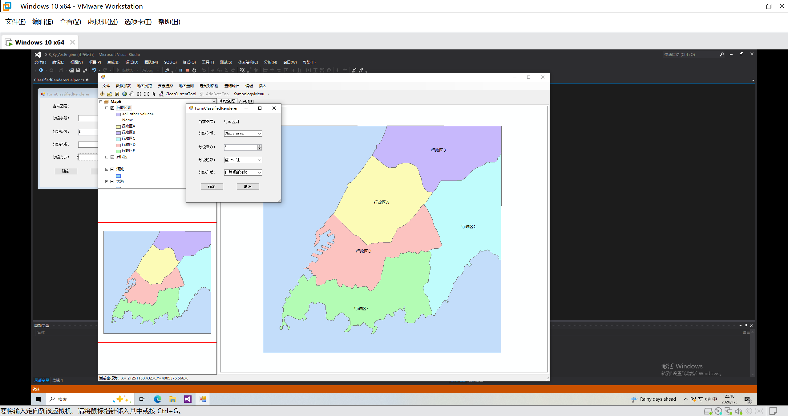

>   **自然间断分级结果**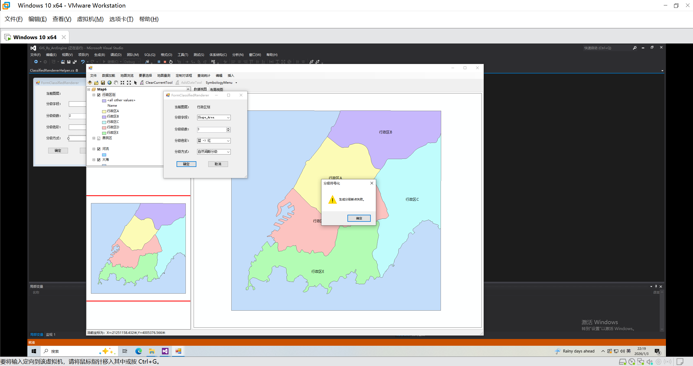

>   **等间距分级界面**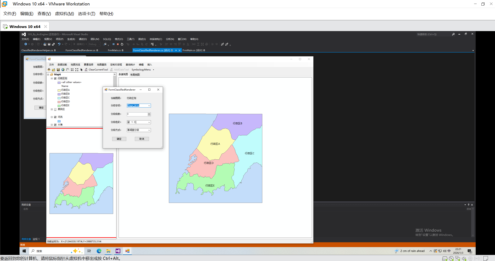

>   **等间距分级结果**

>   **分位数分级界面**

>   **分位数分级结果**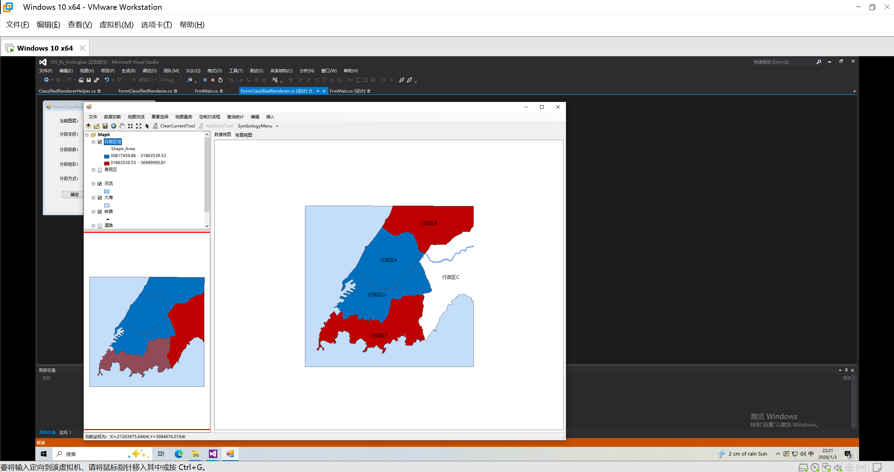

>   **几何间隔分级界面**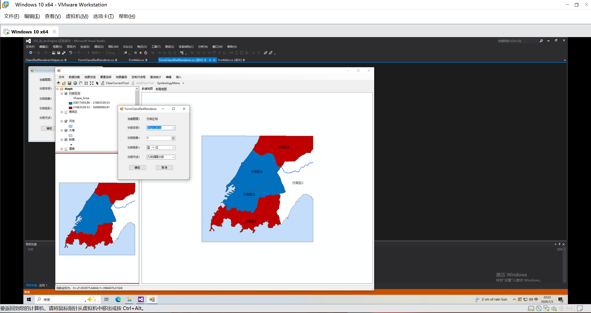

>   **几何间隔分级结果**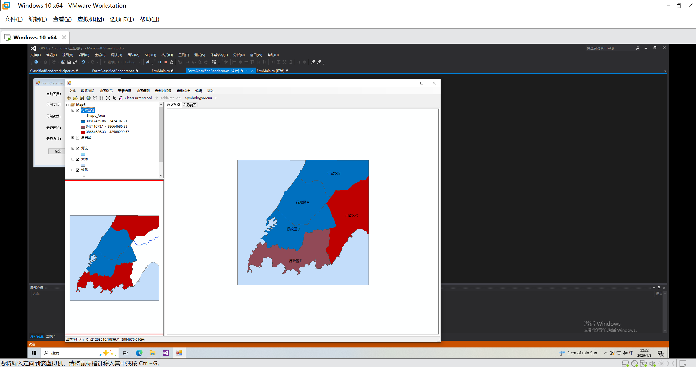

### [▶点击观看演示视频](Video/ClassfiedRenderer_Demo.mp4)

##  至暗时刻(Darkest Time)
>   刚开始我不知道有什么分级方法，我就问了AI再看了看Arcmap里的分级方法，有`自然间隔`、`几何间隔`、`分位数`、`等间距`、`标准差`等。我就想着这几个一起做了吧，反正都是调`Engine`里的，然后`顺顺利利开开心心`地做了，然后运行成功，很舒服。

>   然后开始实验，发现`标准差分级`怎么改都分不出来，前前后后改了一个半小时快崩了，最经典的是`MessageBox`弹窗报错："对COM组件的调用返回了错误 HRESULT E_FAIL."而且我一直改的都是掩盖我的BUG，为了不报错不择手段：
``` C#
int availableBreaks = classBreaks.Length - 1;
int renderBreaks = Math.Min(breakCount, availableBreaks);
```
>   这导致`renderer`显示的级数和算法真实计算的级数已经不一致了，真就是为了不报错而改了；

>   而且标准差分级都是3或5级，但我设置的是2-5，就更可能导致分不出;

>   测试的`data`里的数据量也不大，我感觉没法拟合到正态曲线，更别说算标准差了，算出来就一个级别，我还要分3类5类，不报错才奇怪了;

>   所以在经过一个半小时的挣扎之后，我选择放弃，感觉改不出了，我真燃尽了，四个肯定比要求的两个更好...🤡放过自己


# 三、GIS开发期末大作业 · 布局视图插入要素功能

> **Created By:** 肖容千
> **Date:** 2026.1.4
---

## 功能概述
-   在布局视图中支持插入五类制图要素：`比例尺`、`指北针`、`标题`、`(普通)文本`、`图例`；
-   五类制图要素在`数据视图`状态无法点击，切换到`布局视图`变为`高亮可点击`。均为点击后光标变为`“+”`，`左键`点击屏幕确定插入位置自动生成要素。`比例尺`、`指北针`要素直接生成，`标题`、`文本`、`图例`要素获取窗体参数后自动生成；
-   `比例尺`为“比例线比例尺”只显示首尾和中间刻度，单位为`km`;
-   `指北针`为默认指北针，显示`N、S、W、E`四个方向;

-   `标题`、`文本`、`图例`三个要素均通过窗体获取参数。
    -   `标题`窗体`FormAddTitle`可改变`内容`与`字体大小`，字体限制为`黑体`；
    -   `文本`窗体`FormAddText`可改变`内容`、`字体大小`与`字体`，包括：`宋体`、`黑体`、`微软雅黑`、`Arial`、`Times New Roman`供用户选择；
    -   `图例`窗体`FormAddLegend`可获取加载数据的各个图层数据。选中需要添加的图层，点击添加`Button`可将其加入图例项`ListBox`中，选中图例项`ListBox`中的图层数据点击移除`Button`可将其移除图例项`ListBox`，通过上移和下移`Button`可调整图例之间的顺序。点击确定`Button`会将添加到图例项`ListBox`中的图层数据，从上到下顺序生成图例。

-   文本类元素支持字号、字体（标题固定为黑体），地图整饰类元素采用 ArcEngine 标准 `MapSurround` 实现，确保导出/打印一致；
-   统一调用 `AddElementToLayout` 刷新布局视图，保障即时预览。

## 设计思路
>   和分级符号化一样，先是看了看arcmap里面怎么实现的。这个思路清晰些。

>   就是在`menuStrip1`菜单栏里加一个`插入ToolStripMenuItem`，里面再加`比例尺`、`指北针`、`标题`、`文本`、`图例`。搜了一下资料，明确了具体的思路：

1)  `比例尺`改成比例线的形式，默认的好像是那个黑白相间的，太丑了；

2)  `指北针`用默认的，如果要用别的还得加载一些库，我试了一下，失败了，有了昨天的分级符号的经验，我还是选择默认样式了；

3)  `标题`和`文本`其实窗体很像，但我不想复用，我就怕出一些稀奇古怪的BUG，改完20个BUG后怕了，调用个窗体都不敢乱写了。复用的话还得考虑怎么在标题窗体里把字体选项禁用了，直接把`lblFont`和`cmbFont`的`Visible`设成`False`，就莫名其妙空了一块，索性再开个新窗体好了。代码参见：[Small_ArcGis/FormAddText.cs](Small_ArcGis/FormAddText.cs)、[Small_ArcGis/FormAddTitle.cs](Small_ArcGis/FormAddTitle.cs);

4)  `图例`这个窗体没什么好说的，借鉴了一下arcmap里的做法，拉了一个窗体出来代码参见：[Small_ArcGis/FormAddLegend.cs](Small_ArcGis/FormAddLegend.cs)。

>   接着就是在主窗体写调用这几个窗体的代码，PageLayout的点击事件，这几个要素的生成逻辑，下面给出详细说明：

1)  地图插入要素必须放置在特定的坐标位置。为了达到`先选工具，后点地图`确定位置的效果，采用了状态机模式(`OpenGL`也是状态机...被`计算机图形学`逼疯的一生)。因此利用`InsertMode`枚举标记当前待插入的要素类型。通过 `PageLayoutOnMouseDown`获取用户点击的屏幕坐标，并立即通过`DisplayTransformation`转换为`页面地图坐标（Map Point）`;

2)  `图例`、`比例尺`、`指北针`（基于`IMapSurround`接口开发）三个要素是与图层数据`动态关联`的，即：指北针需要知道地图的方向，比例尺需要知道地图的缩放比例，图例需要读取图层列表。这些要素不能用一个固定的数值生成，必须放到一个具体的地图数据框上。因此，必须编写`GetMapFrame`方法遍历`IGraphicsContainer`，找到当前激活的`IMapFrame`,即数据视图容器，为后续创建的对象提供`数据源`；

3)  `标题`、`文本`则是`静态要素`，不与图层数据相关联，用户想生成什么就生成什么;

4)  因此需要根据这两种不同的要素需要分别对其进行构建，将其放到`PageLayout`上；

5)   静态要素构建 (`标题`、`文本`)：使用`ITextElement`接口创建文本对象，`ITextSymbol`定义字体样式（字体类型、字体大小）；

6)  动态要素构建 (`图例`、`比例尺`、`指北针`)：`IMapSurround`只是逻辑对象，不能直接画在布局上，因此必须创建一个图形容器 `IMapSurroundFrame`来“放置”它。`MapSurroundFrame.MapFrame = mapFrame`成功将`IMapSurround`放到`IMapSurroundFrame`里，实现绑定；

7)  为了不写对应各个要素添加到`PageLayout`的代码，因此写一个`AddElementToLayout`方法封装。将上述步骤生成的要素`IElement`（无论是`TextElement`还是`MapSurroundFrame`）统一添加到视图中;

8)  为了同步显示，也为了不再出现闪烁BUG（又想起了我的代码之前布局视图一直闪烁的悲伤回忆了😭），因此调用`ActiveView.PartialRefresh`,只刷新 `esriViewGraphics`（图形层），不再重绘耗时的`esriViewGeography`（地理数据层），完美同步也不闪烁。

## 核心代码

### 利用 InsertMode 枚举标记当前待插入的要素类型
``` C#
private enum InsertMode
{
    None = 0,
    Title = 1,
    Text = 2,
    Legend = 3,
    ScaleBar = 4,
    NorthArrow = 5
}

private void BeginInsertMode(InsertMode mode)
{
    if (!_isLayoutView)
    {
        return;
    }

    _currentInsertMode = mode;
    axPageLayoutControl1.MousePointer = esriControlsMousePointer.esriPointerCrosshair;
}
```

### PageLayoutMouseDown事件
``` C#
private void axPageLayoutControl1_OnMouseDown(object sender, IPageLayoutControlEvents_OnMouseDownEvent e)
{
    if (_currentInsertMode == InsertMode.None)
    {
        return;
    }

    // 将屏幕坐标(Pixel)转换为布局视图的地图坐标(MapPoint)
    // 对应设计思路：DisplayTransformation转换
    IPoint mapPoint = axPageLayoutControl1.ActiveView.ScreenDisplay.DisplayTransformation.ToMapPoint(e.x, e.y);

    try
    {
        switch (_currentInsertMode)
        {
            case InsertMode.Title:
                InsertTitleAt(mapPoint);
                break;
            case InsertMode.Text:
                InsertTextAt(mapPoint);
                break;
            case InsertMode.Legend:
                InsertLegendAt(mapPoint);
                break;
            case InsertMode.ScaleBar:
                InsertScaleBarAt(mapPoint);
                break;
            case InsertMode.NorthArrow:
                InsertNorthArrowAt(mapPoint);
                break;
        }
    }
    finally
    {
        ResetInsertMode();      // 重置状态
    }
}

```

### GetMapFrame方法遍历IGraphicsContainer
``` C#
// 遍历容器获取当前激活的 MapFrame（数据源）
private IMapFrame GetMapFrame()
{
    IGraphicsContainer container = axPageLayoutControl1.ActiveView.GraphicsContainer;
    // 查找与 FocusMap 关联的框架
    return container.FindFrame(axPageLayoutControl1.ActiveView.FocusMap) as IMapFrame;
}
```

### 静态要素构建：文本、标题
``` C#
// 文本
private void InsertTextAt(IPoint anchor)
{
    using (var dlg = new FormAddText())
    {
        if (dlg.ShowDialog() != DialogResult.OK)
        {
            return;
        }

        if (string.IsNullOrWhiteSpace(dlg.TextContent))
        {
            MessageBox.Show("文本内容不能为空", "插入文本", MessageBoxButtons.OK, MessageBoxIcon.Information);
            return;
        }

        ITextElement textElement = new TextElementClass();
        textElement.Text = dlg.TextContent;

        ITextSymbol textSymbol = new TextSymbolClass
        {
            Color = CreateRgbColor(0, 0, 0),
            Size = dlg.FontSize,
            Font = new StdFontClass
            {
                Name = dlg.FontName,
                Size = (decimal)dlg.FontSize
            } as IFontDisp
        };

        textElement.Symbol = textSymbol;

        IElement element = textElement as IElement;
        element.Geometry = anchor;

        AddElementToLayout(element);
    }
}

// 标题
private void InsertTitleAt(IPoint anchor)
{
    using (var dlg = new FormAddTitle())
    {
        if (dlg.ShowDialog() != DialogResult.OK)
        {
            return;
        }

        if (string.IsNullOrWhiteSpace(dlg.TitleText))
        {
            MessageBox.Show("标题内容不能为空", "插入标题", MessageBoxButtons.OK, MessageBoxIcon.Information);
            return;
        }

        ITextElement textElement = new TextElementClass();
        textElement.Text = dlg.TitleText;

        ITextSymbol textSymbol = new TextSymbolClass
        {
            Color = CreateRgbColor(0, 0, 0),
            Size = dlg.FontSize,
            Font = new StdFontClass
            {
                Name = "黑体",
                Size = (decimal)dlg.FontSize
            } as IFontDisp
        };

        textElement.Symbol = textSymbol;

        IElement element = textElement as IElement;
        element.Geometry = anchor;

        AddElementToLayout(element);
    }
}
```

### 动态要素构建：比例尺、图例、指北针
``` C#
// 比例尺
private void InsertScaleBarAt(IPoint anchor)
{
    IMapFrame mapFrame = GetMapFrame();
    if (mapFrame == null)
    {
        MessageBox.Show("未找到地图框架，无法添加比例尺。", "插入比例尺", MessageBoxButtons.OK, MessageBoxIcon.Warning);
        return;
    }

    // 使用ScaleLineClass创建比例线样式
    IScaleBar scaleBar = new ScaleLineClass();
    scaleBar.Units = esriUnits.esriKilometers;
    scaleBar.UnitLabel = "km";
    scaleBar.LabelPosition = esriVertPosEnum.esriBelow;
    scaleBar.Division = 1;           // 主刻度数量为1（两个刻度点：0和终点）
    scaleBar.Subdivisions = 1;       // 不需要细分
    scaleBar.DivisionsBeforeZero = 0; // 零点之前无刻度
    scaleBar.LabelFrequency = esriScaleBarFrequency.esriScaleBarDivisions;

    IMapSurroundFrame surroundFrame = new MapSurroundFrameClass
    {
        MapSurround = scaleBar as IMapSurround,
        MapFrame = mapFrame
    };

    IElement element = (IElement)surroundFrame;
    IEnvelope env = new EnvelopeClass();
    double width = 2.5;
    double height = 0.5;
    env.PutCoords(anchor.X, anchor.Y, anchor.X + width, anchor.Y + height);
    element.Geometry = env;

    AddElementToLayout(element);
}

// 图例
private void InsertLegendAt(IPoint anchor)
{
    IMapFrame mapFrame = GetMapFrame();
    if (mapFrame == null)
    {
        MessageBox.Show("未找到地图框架，无法添加图例。", "插入图例", MessageBoxButtons.OK, MessageBoxIcon.Warning);
        return;
    }

    using (var dlg = new FormAddLegend(mapFrame.Map))
    {
        if (dlg.ShowDialog() != DialogResult.OK)
        {
            return;
        }

        if (dlg.SelectedLayers == null || dlg.SelectedLayers.Count == 0)
        {
            MessageBox.Show("请至少选择一个图层用于图例。", "插入图例", MessageBoxButtons.OK, MessageBoxIcon.Information);
            return;
        }

        IMapSurroundFrame surroundFrame = mapFrame.CreateSurroundFrame(new UIDClass { Value = "esriCarto.Legend" }, null);

        ILegend legend = surroundFrame != null ? surroundFrame.MapSurround as ILegend : null;
        if (legend == null)
        {
            MessageBox.Show("创建图例失败。", "插入图例", MessageBoxButtons.OK, MessageBoxIcon.Warning);
            return;
        }
        // 先自动填充图例以获取默认设置
        legend.AutoAdd = false;
        legend.AutoReorder = false;
        legend.AutoVisibility = true;
        // 清除默认的图例项
        legend.ClearItems();

        foreach (ILayer layer in dlg.SelectedLayers)
        {
            // 创建新的图例项并关联图层
            ILegendItem legendItem = new HorizontalLegendItemClass();
            legendItem.Layer = layer;
            legendItem.ShowDescriptions = false;
            //legendItem.ShowHeadings = false;
            legendItem.ShowLabels = true;
            legendItem.ShowLayerName = true;

            // 设置图例项的列数
            legendItem.Columns = 1;
            legendItem.KeepTogether = true;

            legend.AddItem(legendItem);
        }

        surroundFrame.MapFrame = mapFrame;

        IElement element = (IElement)surroundFrame;
        IEnvelope env = new EnvelopeClass();
        double width = 2.5;
        double height = 3.0;
        env.PutCoords(anchor.X, anchor.Y, anchor.X + width, anchor.Y + height);
        element.Geometry = env;

        AddElementToLayout(element);
    }
}

// 指北针
private void InsertNorthArrowAt(IPoint anchor)
{
    IMapFrame mapFrame = GetMapFrame();
    if (mapFrame == null)
    {
        MessageBox.Show("未找到地图框架，无法添加指北针。", "插入指北针", MessageBoxButtons.OK, MessageBoxIcon.Warning);
        return;
    }

    IMarkerNorthArrow northArrow = new MarkerNorthArrowClass();
    INorthArrow arrow = northArrow as INorthArrow;
    if (arrow != null)
    {
        arrow.Color = CreateRgbColor(0, 0, 0);
    }

    IMapSurroundFrame surroundFrame = new MapSurroundFrameClass
    {
        MapSurround = northArrow as IMapSurround,
        MapFrame = mapFrame
    };

    IElement element = (IElement)surroundFrame;
    IEnvelope env = new EnvelopeClass();
    double size = 1.0;
    env.PutCoords(anchor.X, anchor.Y, anchor.X + size, anchor.Y + size);
    element.Geometry = env;

    AddElementToLayout(element);
}
```

### 统一添加要素、及时同步防闪烁
``` C#
private void AddElementToLayout(IElement element)
{
    // 1. 获取布局视图的图形容器
    IGraphicsContainer container = axPageLayoutControl1.ActiveView.GraphicsContainer;
    
    // 2. 添加元素 (Z-order 0 表示最上层)
    container.AddElement(element, 0);
    
    // 3. 局部刷新 (关键优化)
    // 只刷新 esriViewGraphics (图形层)，不重绘 Geography (地图数据层)
    // 彻底解决闪烁问题
    axPageLayoutControl1.ActiveView.PartialRefresh(esriViewDrawPhase.esriViewGraphics, null, null);
}
```

##  功能实现截图
>   **添加文本界面**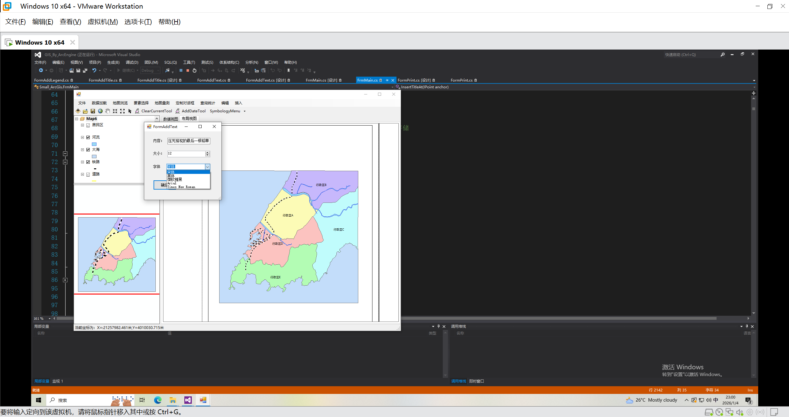

>   **添加文本结果**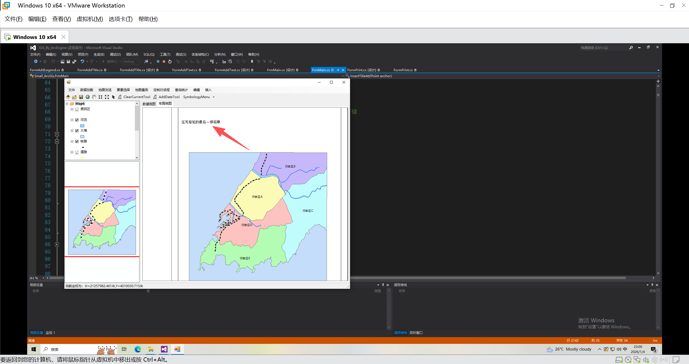

>   **添加比例尺结果**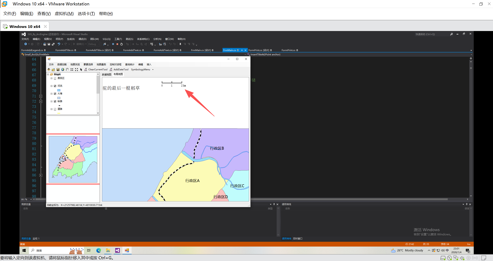

>   **添加图例界面**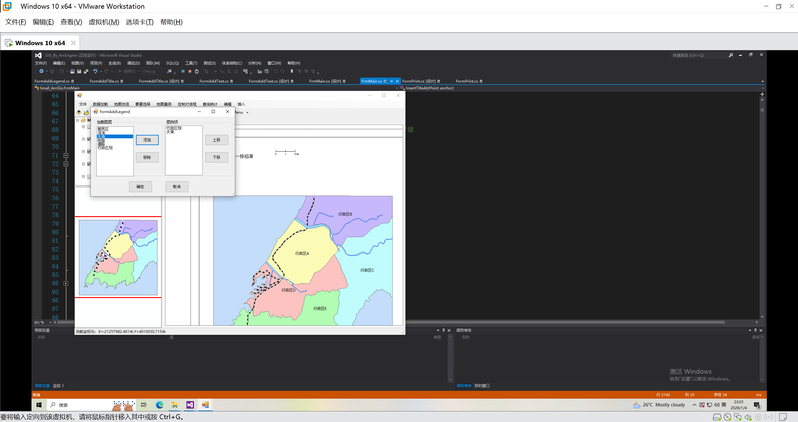

>   **添加图例结果**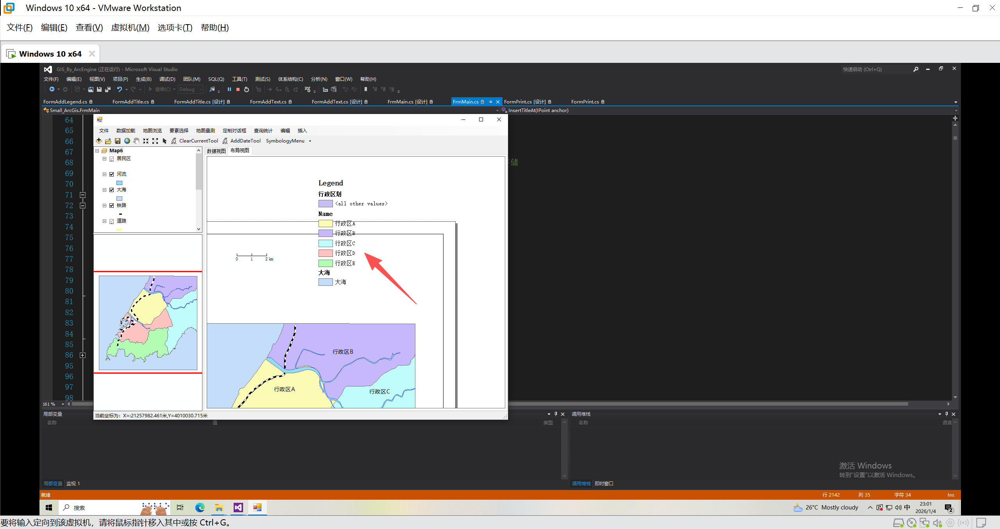

>   **添加指北针结果**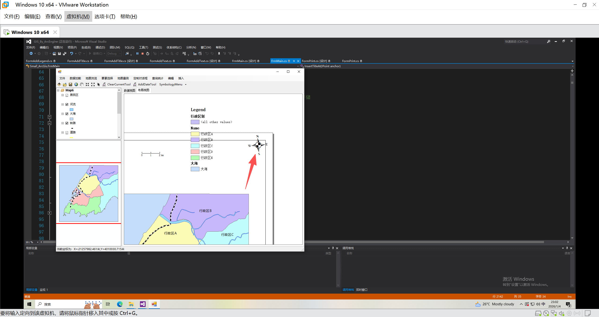

>   **添加标题界面**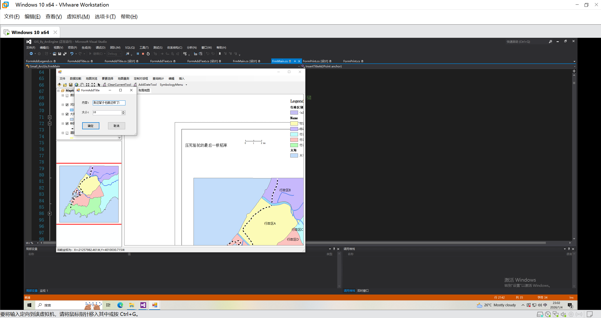

>   **添加标题结果**

### [▶点击观看演示视频](Video/Add_Demo.mp4)


# 四、GIS开发期末大作业 · 布局视图打印与导出功能技术文档

> **Created By:** 肖容千
> **Date:** 2026.1.5
---

## 功能概述
-   实现了基于`布局视图`（PageLayout）的`地图打印预览`与`多格式导出`功能；

-   新建独立的打印/导出设置窗体`FormPrint`，`PictureBox`支持实时打印预览。预览图会根据纸张设置实时同步刷新，达到`所见即所得`的效果；

-   支持多种纸张规格设置：包括 `A4`、`A3`、`A2`、`Letter`，并支持`横向`与`纵向`两种排版方向切换；

-   支持`PDF文档导出`：底层逻辑实现了高精度的`PDF`导出功能，支持选择`系统打印机`作为配置参考；

-   支持`图片格式导出`：支持将当前布局视图导出为 `JPG` 或 `PNG` 格式图片，并支持自定义分辨率`DPI`（200-600）；

-   **导出路径交互**：
    -   浏览按钮采用 `SaveFileDialog`，允许用户在弹窗中直接修改`文件名`和`文件路径`；

    -   导出按钮逻辑优化：直接读取路径文本框内容执行导出，不再重复弹出 `SaveFileDialog`对话框；

    -   支持`自动化路径与名称管理`：设置默认导出路径`defaultFileName`、自动根据当前日期`yymmdd`生成默认文件名（如`地图导出_250105`），并根据导出格式自动修正后缀名。


## 设计思路
>   这次看见要求也是和前两次一样，先去看了arcmap里面的打印和导出界面是咋样的。arcmap里的打印太高级了，一个打印窗体能连着三个其他窗体。想到在课上写过一个导出界面，结合了两者，拉出了一个窗体。

>   这个窗体我拉了快两个小时...一直在纠结怎么拉直观也美观，老师在课上也展示过，但我觉得那个又要弹出几个新窗体既不直观也麻烦，而且好像没法实时显示预览。最后拉出了一个这样的窗体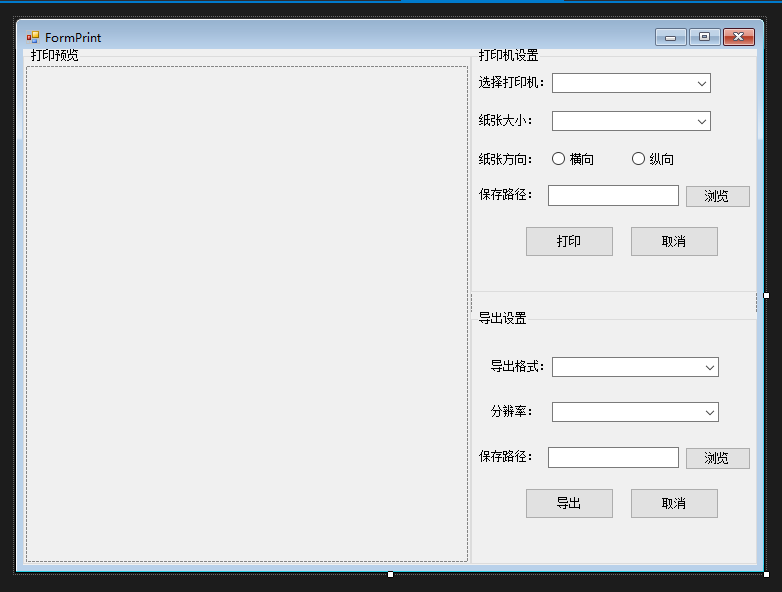
我已经很满意了，虽然两个取消按钮很冗余，但至少对称不是嚒？(^▽^)o

1)  **对预览的执念**：
    -   之前在用arcmap出图的时候，对这个深恶痛绝。我每次都要打印出来才知道长什么样就很反人类，不喜欢还要删掉，一次出图得删五六张废图。

    -   老师展示的窗体里有一个打印预览，这个似乎是要弹出一个大窗体的，但我觉得不实时，不像我这个嘿嘿嘿，真的很满意这个实时预览，切换的时候也不会触发过于明显的刷新闪烁，很平滑，很流畅，很舒服。
    -   用`Bitmap`在内存里建一张纸，然后利用`IActiveView.Output`方法把当前布局视图“画”到这个`Bitmap`的`HDC`（设备上下文）上，最后把图赋给`PictureBox`。这样调整横纵向、纸张大小时，预览图能马上变，体验拉满，太流畅了；

    -   但我开始很天真，我开始想用`axPageLayoutControl`控件，然后写个同步直接把主窗体的`Layout`给`copy`过来，但很不幸，这玩意和我设置的纸张大小比例完全不一样；

    -   然后换了`PictureBox`，想着直接把它重绘，很明显，失败了，闪的我眼睛都快瞎了😭，而且`PictureBox`设不了双缓冲啊，Form设置双缓冲只是闪的不那么明显了...

    -   然后问了`Gemini`，先用`Bitmap`把图画在内存里，再放出来，其实就达到了双缓冲的目的了（`计算机图形学立大功`）。

    -   为什么要这个`HDC`。其实就跟`计算机图形学`的`glfwMakeContextCurrent(window);`一样，必须有个中间人来传数据，不然双方都看不懂信息。（刻在骨子里的`计算机图形学`...但确实好像）

        >   其实我感觉老师的文档要求给错了，为什么是`MapControl`，应该是`PageLayout`吧？之前不写过一个导出`MapControl`里的功能嚒。

2)  **导出路径**：
    -   最开始有个`BUG`：点`浏览`Button选好路径后，点`导出\打印`Button又弹了一次保存框，导致之前浏览选的路径根本没用了。修复后，点击`导出`Button时会直接读取文本框里的路径，只有当路径为空时才提醒；

    -   然后浏览按钮用的是`FolderBrowserDialog`，只能选文件夹，文件名还得回主界面手敲，累累的。后来改成了`SaveFileDialog`，这样在浏览时就能直接定好文件名，不赖；
    

3)  **PDF与图片导出**：代码里的`打印`Button目的是导出PDF（`ExportPDFClass`）：图片导出使用了`ExportJPEGClass`和`ExportPNGClass`。这有个关键点：必须根据选定的纸张尺寸（英寸）乘以DPI来计算`PixelBounds`，并读取`activeView.ExportFrame`，这样导出来的尺寸才是对的，且不会有巨大留白；

4)  **导入PageLayout**：`FormPrint`窗体不能凭空导出，它得知道主窗体里画了啥。所以在构造函数里加了个参数`public FormPrint(AxPageLayoutControl mainPageLayoutControl)`，把主窗体的布局控件传进来,这也在打印窗体里操作的`ActiveView`，就是主窗体里的`PageLayout`；

5)  **资源清理**：导出对象`IExport`用完调用`Cleanup()`；预览用的`Bitmap`用完调用`Dispose()`，不然点几次预览内存就爆了，保证不崩溃。


## 核心代码

### 实时预览生成(Bitmap伪双缓冲)
``` C#
/// <summary>
/// 更新打印预览
/// </summary>
private void UpdatePreview()
{
    if (_mainPageLayoutControl == null || _mainPageLayoutControl.ActiveView == null)
    {
        picPreview.Image = null;
        return;
    }

    try
    {
        // 清理旧的预览图片
        if (_previewBitmap != null)
        {
            picPreview.Image = null;
            _previewBitmap.Dispose();
            _previewBitmap = null;
        }

        // 获取纸张尺寸
        double widthInches, heightInches;
        GetPaperSizeInInches(out widthInches, out heightInches);

        // 使用较低的预览分辨率以提高性能
        int previewDpi = 96;
        int previewWidth = (int)(widthInches * previewDpi);
        int previewHeight = (int)(heightInches * previewDpi);

        // 创建预览位图
        _previewBitmap = new Bitmap(previewWidth, previewHeight);

        using (Graphics g = Graphics.FromImage(_previewBitmap))
        {
            g.Clear(Color.White);

            // 获取 HDC
            IntPtr hdc = g.GetHdc();

            try
            {
                // 设置输出矩形
                tagRECT outputRect;
                outputRect.left = 0;
                outputRect.top = 0;
                outputRect.right = previewWidth;
                outputRect.bottom = previewHeight;

                // 输出到 HDC
                IActiveView activeView = _mainPageLayoutControl.ActiveView;
                activeView.Output(hdc.ToInt32(), previewDpi, ref outputRect, null, null);
            }
            finally
            {
                g.ReleaseHdc(hdc);
            }
        }

        // 显示预览
        picPreview.Image = _previewBitmap;
    }
    catch (Exception ex)
    {
        // 如果渲染失败，显示错误信息
        if (_previewBitmap != null)
        {
            _previewBitmap.Dispose();
            _previewBitmap = null;
        }

        _previewBitmap = new Bitmap(400, 300);
        using (Graphics g = Graphics.FromImage(_previewBitmap))
        {
            g.Clear(Color.White);
            g.DrawString("预览生成失败:\n" + ex.Message,
                new Font("Microsoft YaHei", 10),
                Brushes.Red,
                new RectangleF(10, 10, 380, 280));
        }
        picPreview.Image = _previewBitmap;
    }
}

```

### PDF导出
``` C#
/// <summary>
/// 导出为PDF
/// </summary>
private void ExportToPDF(string outputPath)
{
    // 始终使用主窗体的 PageLayoutControl 进行导出，避免 COM 对象复制问题
    if (_mainPageLayoutControl == null || _mainPageLayoutControl.ActiveView == null)
    {
        throw new Exception("无法获取活动视图");
    }

    IActiveView activeView = _mainPageLayoutControl.ActiveView;
    IExport pExport = null;

    try
    {
        // 创建PDF导出对象
        pExport = new ExportPDFClass();
        pExport.ExportFileName = outputPath;

        // 设置分辨率
        int dpi = 300;
        pExport.Resolution = dpi;

        // 获取导出范围 - 使用 PageLayout 的实际范围
        tagRECT exportRect = activeView.ExportFrame;

        // 根据纸张大小设置尺寸（像素）
        int width = (int)(8.27 * dpi);   // A4 默认宽度
        int height = (int)(11.69 * dpi); // A4 默认高度

        if (cmbPaperSize.SelectedItem != null)
        {
            switch (cmbPaperSize.SelectedItem.ToString())
            {
                case "A3":
                    width = (int)(11.69 * dpi);
                    height = (int)(16.54 * dpi);
                    break;
                case "A2":
                    width = (int)(16.54 * dpi);
                    height = (int)(23.39 * dpi);
                    break;
                case "Letter":
                    width = (int)(8.5 * dpi);
                    height = (int)(11 * dpi);
                    break;
            }
        }

        // 根据纸张方向调整
        if (radioButton1.Checked) // 横向
        {
            int temp = width;
            width = height;
            height = temp;
        }

        exportRect.left = 0;
        exportRect.top = 0;
        exportRect.right = width;
        exportRect.bottom = height;

        // 设置导出像素范围
        IEnvelope pEnvelope = new EnvelopeClass();
        pEnvelope.PutCoords(exportRect.left, exportRect.top, exportRect.right, exportRect.bottom);
        pExport.PixelBounds = pEnvelope;

        // 开始导出
        int hDC = pExport.StartExporting();
        activeView.Output(hDC, dpi, ref exportRect, null, null);
        pExport.FinishExporting();
    }
    finally
    {
        // 确保清理资源
        if (pExport != null)
        {
            pExport.Cleanup();
        }
    }
}
```

### 图片导出
``` C#
/// <summary>
/// 导出为图片
/// </summary>
private void ExportToImage(string outputPath, bool isPng, int dpi)
{
    // 始终使用主窗体的 PageLayoutControl 进行导出，避免 COM 对象复制问题
    if (_mainPageLayoutControl == null || _mainPageLayoutControl.ActiveView == null)
    {
        throw new Exception("无法获取活动视图");
    }

    IActiveView activeView = _mainPageLayoutControl.ActiveView;
    IExport pExport = null;

    try
    {
        // 创建导出对象
        if (isPng)
        {
            pExport = new ExportPNGClass();
        }
        else
        {
            pExport = new ExportJPEGClass();
        }

        pExport.ExportFileName = outputPath;
        pExport.Resolution = dpi;

        // 获取导出范围 - 使用 PageLayout 的实际范围
        tagRECT exportRect = activeView.ExportFrame;

        // 计算导出尺寸（根据分辨率缩放）
        double scale = dpi / 96.0;
        int width = (int)(exportRect.right * scale);
        int height = (int)(exportRect.bottom * scale);

        exportRect.left = 0;
        exportRect.top = 0;
        exportRect.right = width;
        exportRect.bottom = height;

        // 设置导出像素范围
        IEnvelope pEnvelope = new EnvelopeClass();
        pEnvelope.PutCoords(exportRect.left, exportRect.top, exportRect.right, exportRect.bottom);
        pExport.PixelBounds = pEnvelope;

        // 开始导出
        int hDC = pExport.StartExporting();
        activeView.Output(hDC, dpi, ref exportRect, null, null);
        pExport.FinishExporting();
    }
    finally
    {
        // 确保清理资源
        if (pExport != null)
        {
            pExport.Cleanup();
        }
    }
}

```
### 打印路径交互（SaveFileDialog）
``` C#
/// <summary>
/// 浏览PDF保存路径 (改为 SaveFileDialog)
/// </summary>
private void BtnExPath1_Click(object sender, EventArgs e)
{
    using (SaveFileDialog dialog = new SaveFileDialog())
    {
        dialog.Title = "选择PDF保存路径";
        dialog.Filter = "PDF文件(*.pdf)|*.pdf";
        dialog.OverwritePrompt = false; //因为真正保存是在点"打印"时，这里设为false避免重复弹窗，或者设为true作为预警也可以

        // 尝试获取当前文本框的路径作为初始目录
        string currentPath = txtExPath1.Text.Trim();
        if (!string.IsNullOrEmpty(currentPath))
        {
            try
            {
                string dir = System.IO.Path.GetDirectoryName(currentPath);
                string fileName = System.IO.Path.GetFileName(currentPath);

                if (System.IO.Directory.Exists(dir))
                {
                    dialog.InitialDirectory = dir;
                }
                dialog.FileName = fileName;
            }
            catch { } // 忽略路径解析错误
        }
        else
        {
            // 如果文本框为空，给个默认名
            dialog.FileName = "地图导出_" + DateTime.Now.ToString("yyMMdd") + ".pdf";
        }

        if (dialog.ShowDialog() == DialogResult.OK)
        {
            txtExPath1.Text = dialog.FileName;
        }
    }
}

```

### 导出路径交互（SaveFileDialog）
``` C#
/// <summary>
/// 浏览图片保存路径 (改为 SaveFileDialog)
/// </summary>
private void BtnExPath2_Click(object sender, EventArgs e)
{
    using (SaveFileDialog dialog = new SaveFileDialog())
    {
        dialog.Title = "选择图片保存路径";

        // 1. 判断当前选中的格式
        bool isPng = false;
        if (cmbExportFormat.SelectedItem != null && cmbExportFormat.SelectedItem.ToString().Contains("PNG"))
        {
            isPng = true;
        }

        // 2. 动态设置过滤器
        if (isPng)
        {
            dialog.Filter = "PNG图片(*.png)|*.png";
            dialog.DefaultExt = "png";
        }
        else
        {
            dialog.Filter = "JPEG图片(*.jpg)|*.jpg";
            dialog.DefaultExt = "jpg";
        }

        // 3. 尝试获取当前文本框的路径作为初始目录
        string currentPath = txtExPath2.Text.Trim();
        if (!string.IsNullOrEmpty(currentPath))
        {
            try
            {
                string dir = System.IO.Path.GetDirectoryName(currentPath);
                string fileName = System.IO.Path.GetFileName(currentPath);

                // 如果当前文本框里的后缀和选中的格式不符，自动修正文件名后缀
                string expectedExt = isPng ? ".png" : ".jpg";
                if (!fileName.ToLower().EndsWith(expectedExt))
                {
                    fileName = System.IO.Path.GetFileNameWithoutExtension(fileName) + expectedExt;
                }

                if (System.IO.Directory.Exists(dir))
                {
                    dialog.InitialDirectory = dir;
                }
                dialog.FileName = fileName;
            }
            catch { }
        }
        else
        {
            string ext = isPng ? ".png" : ".jpg";
            dialog.FileName = "地图导出_" + DateTime.Now.ToString("yyMMdd") + ext;
        }

        if (dialog.ShowDialog() == DialogResult.OK)
        {
            txtExPath2.Text = dialog.FileName;
        }
    }
}
```

### 直接执行打印（去除冗余弹窗）
``` C#
private void BtnPrint_Click(object sender, EventArgs e)
{
    ...
    // 1. 直接获取文本框路径
    string outputPath = txtExPath1.Text.Trim();

    // 2. 校验路径是否为空
    if (string.IsNullOrEmpty(outputPath))
    {
        MessageBox.Show("请先设置保存路径！", "提示", MessageBoxButtons.OK, MessageBoxIcon.Warning);
        return;
    }

    try
    {
        // 3. 直接调用导出方法，不再弹出 SaveFileDialog
        ExportToPDF(outputPath);
        MessageBox.Show("PDF导出成功！\n保存路径: " + outputPath, "成功", MessageBoxButtons.OK, MessageBoxIcon.Information);
    }
    catch (Exception ex)
    {
        MessageBox.Show("打印失败: " + ex.Message, "错误", MessageBoxButtons.OK, MessageBoxIcon.Error);
    }
}
```

### 直接执行导出（去除冗余弹窗）
``` C#
/// <summary>
/// 导出按钮点击事件
/// </summary>
private void BtnExport_Click(object sender, EventArgs e)
{
    if (cmbExportFormat.SelectedItem == null)
    {
        MessageBox.Show("请选择导出格式！", "提示", MessageBoxButtons.OK, MessageBoxIcon.Warning);
        return;
    }

    // 1. 获取文本框路径
    string outputPath = txtExPath2.Text.Trim();

    // 2. 校验路径
    if (string.IsNullOrEmpty(outputPath))
    {
        MessageBox.Show("请先设置保存路径！", "提示", MessageBoxButtons.OK, MessageBoxIcon.Warning);
        return;
    }

    try
    {
        string format = cmbExportFormat.SelectedItem.ToString();

        // 确保扩展名正确（防止用户手动改了文本框但没改后缀）
        // 如果文本框里是 .jpg 但选的是 PNG格式，这里可以做个强制修正，或者信任用户
        // 这里保持简单，直接用文本框的路径

        // 获取分辨率
        int dpi = 300;
        if (cmbDPI.SelectedItem != null)
        {
            int.TryParse(cmbDPI.SelectedItem.ToString(), out dpi);
        }

        // 3. 直接导出，不再弹出 SaveFileDialog
        ExportToImage(outputPath, format.Contains("PNG"), dpi);

        MessageBox.Show("图片导出成功！\n保存路径: " + outputPath, "成功", MessageBoxButtons.OK, MessageBoxIcon.Information);
    }
    catch (Exception ex)
    {
        MessageBox.Show("导出失败: " + ex.Message, "错误", MessageBoxButtons.OK, MessageBoxIcon.Error);
    }
}

```


## 功能实现截图
>   **打印导出主界面（预览A4横向）**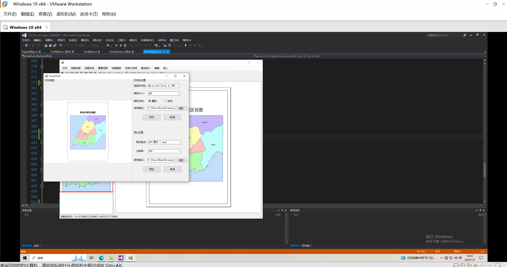

>   **打印导出主界面（预览A4纵向）**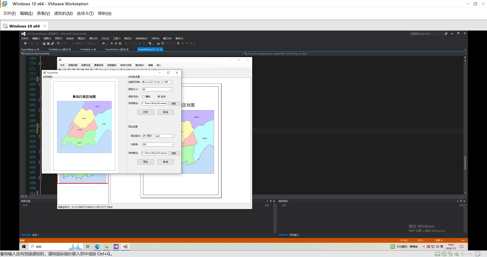

>   **打印机**

>   **纸张大小**

>   **图片格式**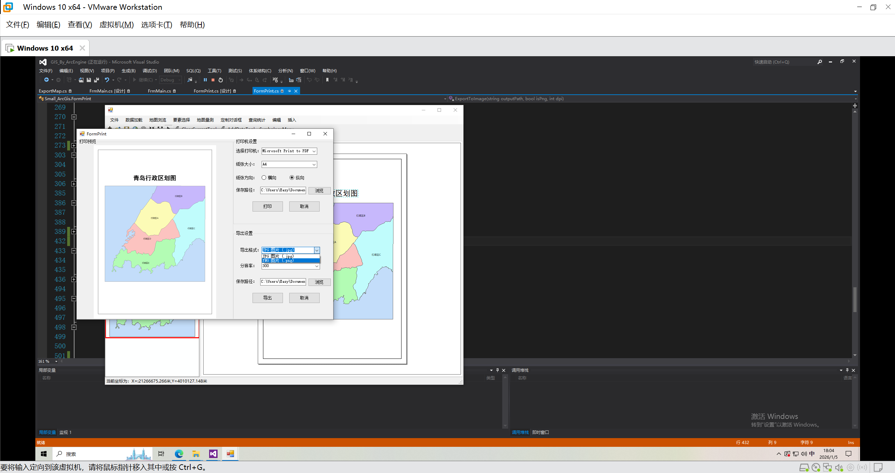

>   **图片DPI**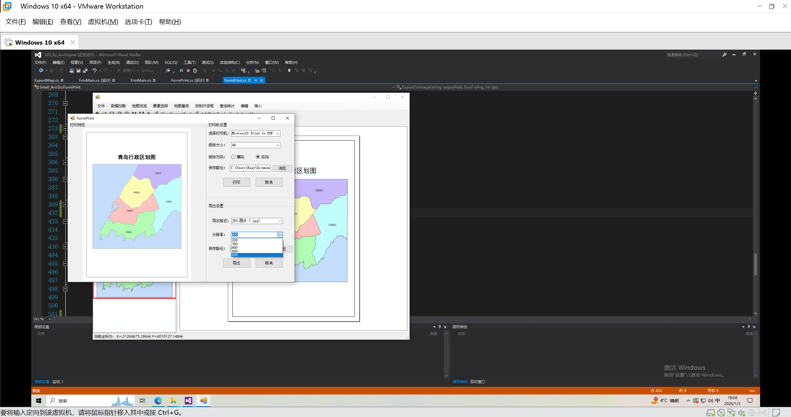

>   **PDF导出**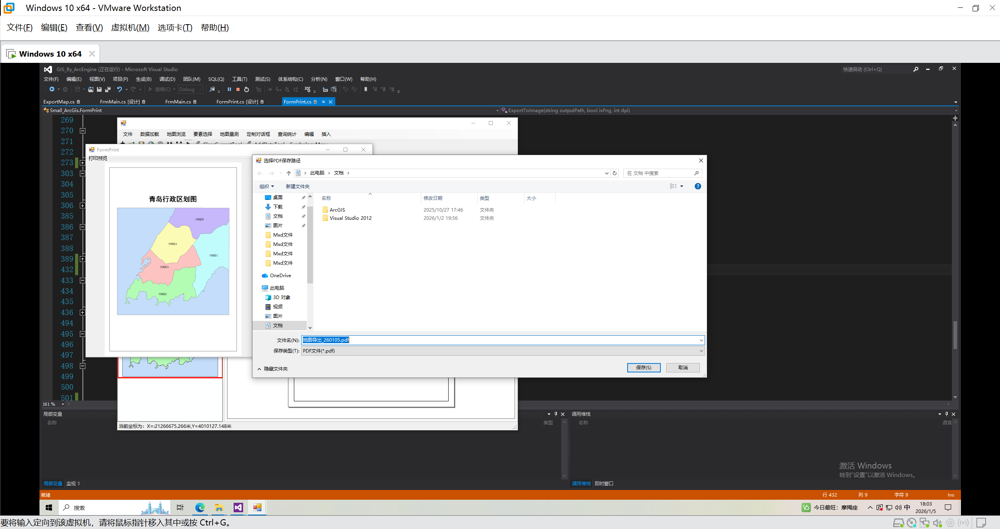

>   **PDF导出**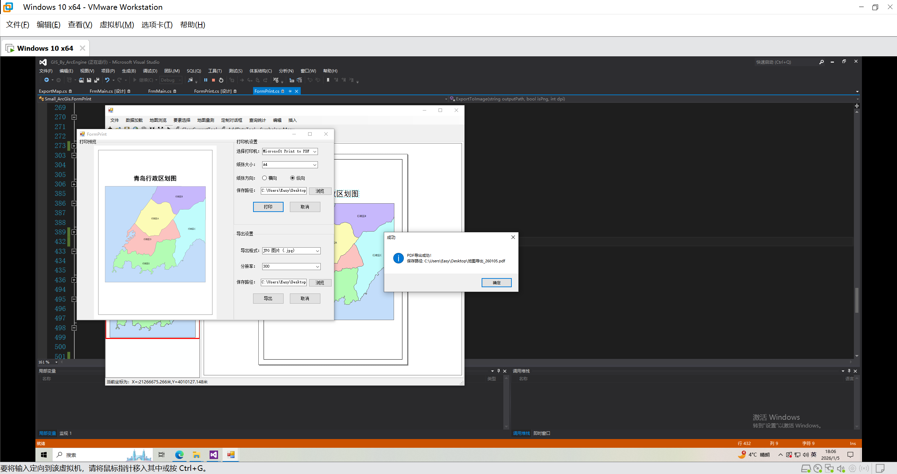

### **📄点击查看PDF** [地图导出_230105](Image/PrintAndOutPut_Image/地图导出_260105.pdf)

>   **JPG导出**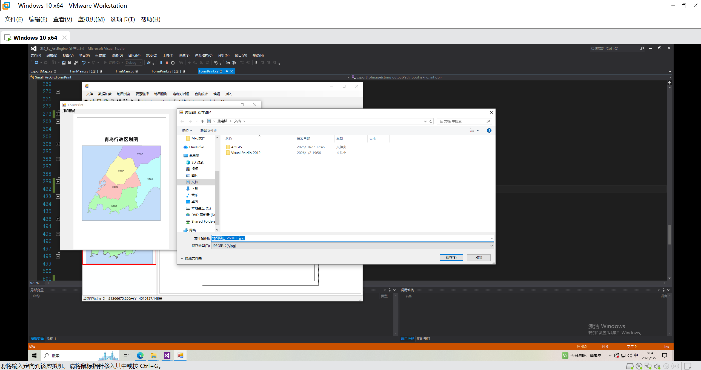

>   **JPG导出**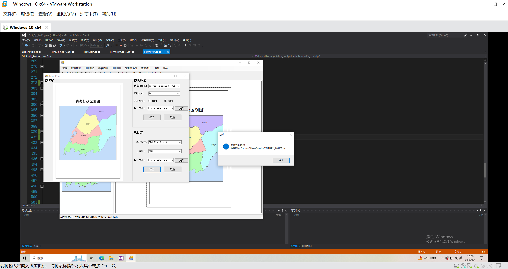

>   **JPG导出实例**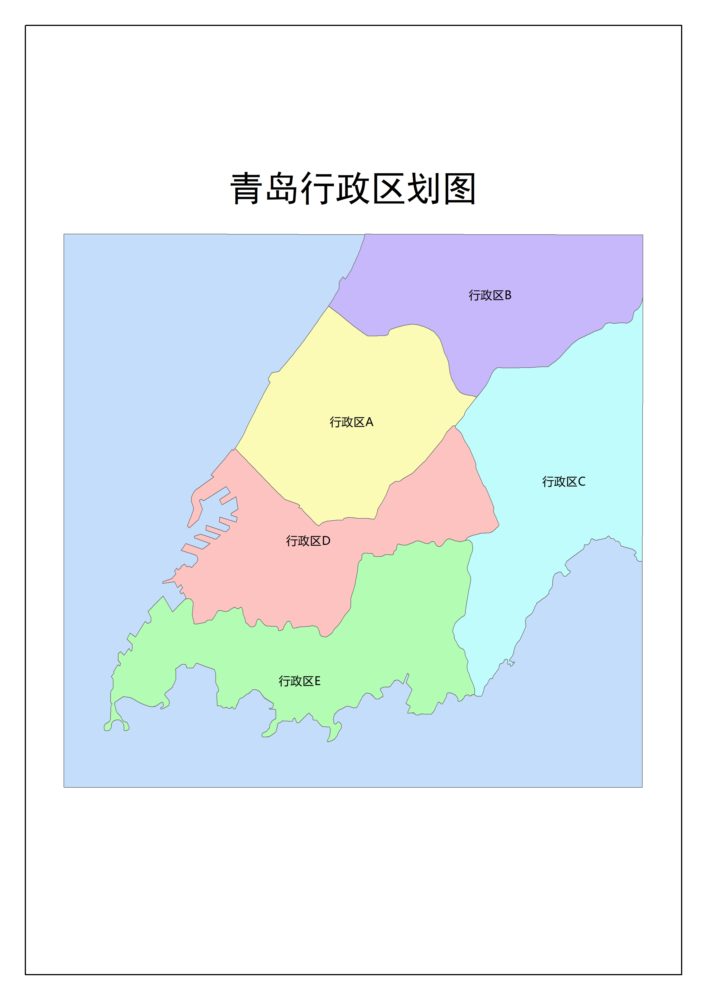

### [▶点击观看演示视频](Video/Print_Demo.mp4)

>   **JPG制图实例**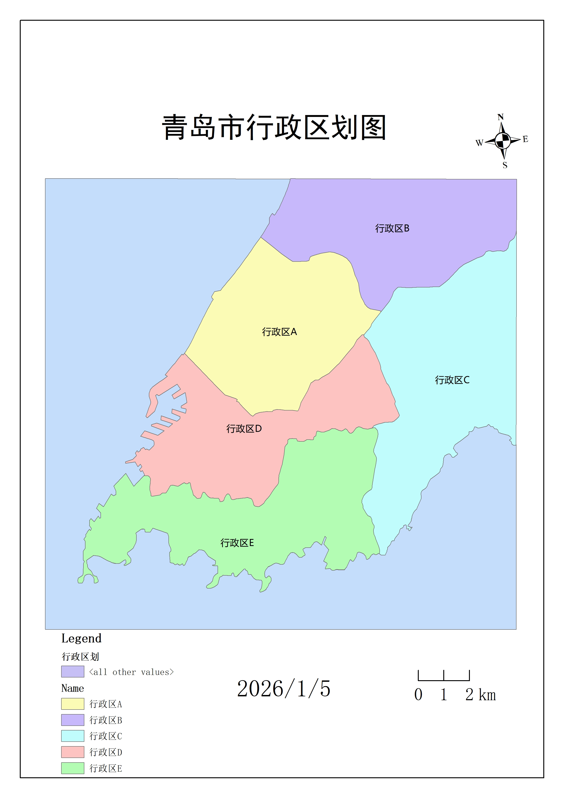

>   **📄点击查看PDF** [青岛市行政区划图](Image/Map_Image/青岛市行政区划图.pdf)


#   五、收获与展望
>   始`2025.2.25`

>   经过一年的`C#`有关课程的学习，从上学期最开始的命令行`Console`输出再到写出第一个`屏幕上不断移动的颜文字、小方块`，再到上学期期末写的`华容道`、`简易CAD`、`Spider表盘`，接着到这学期实现的`简易GIS软件`，自己写了很多小项目，这些都很有意思，也让我对编程有了很强的兴趣。

>   在大二上学C语言的时候，觉得这东西太枯燥了，一学期感觉都在和数学逻辑打交道，似乎都落不到现实上，看不见实的东西。但大二下接触了`C#`和`Web端开发`，我才发现原来我可以实现这么多东西，做一个小网页，做一个小游戏等等。

>   在这种兴趣逐渐浓厚的过程中也慢慢地能够让自己沉下心来真正去研究底层的东西，从最初在`devc++`上连个冒泡排序都不想敲的我，慢慢成为了一个愿意仔细去看一个`Bresenham`算法，愿意为了自己想要实现某个功能去查各种资料，愿意逐行敲`OpenGL`的代码，学`Markdown`格式记录自己的想法以及代码的我；
    >   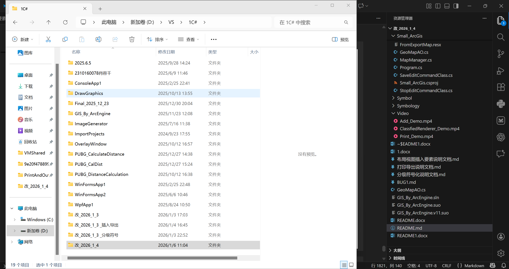
    >   **用WinForm可视化的栅格化算法**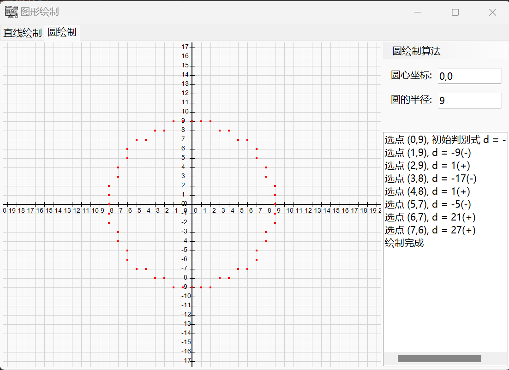
    >   **用WinForm为启动窗口，ImGUI为绘图层的PUBG的测距工具**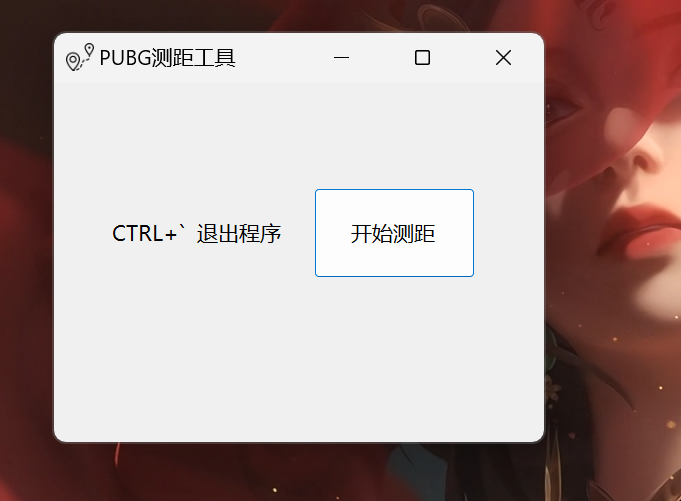

>   这学期写的GIS软件是我第一次接触到的，第一次自己一步一步敲出来这么多代码，创建了这么多项目文件，让我意识到了原来基于一个又一个的功能需要这么大的代码量，实现一个功能需要好几个函数。这不仅让我学习到了如何基于`ArcEgine`进行开发，也让我学到了软件开发背后的逻辑，让我见识到了开发一个软件背后的巨大工作量。

>   在完善代码，修复`BUG`时，我始终在碰壁，修完一个BUG而后又冒出一个BUG，即使到现在，仍然有些小不足，如:鹰眼无法同步`PageLayOut`，碍于时间限制，我无法进一步修改，但我会奔着更好的方向努力的。

>   不知道马老师是否会看到这里，但是我始终很感谢马老师在学习路上对我的指引。马老师的讲课风格也很轻松，我一直很喜欢轻松的课堂氛围，马老师会在课上提醒我们变天多穿衣服，甲流注意戴口罩，也会在下午三点的课上讲一些趣事让我们打起精神。很幸运我可以遇到您这样认真负责的老师带我C#入门，非常感谢马老师对我在编程路上的指引。

>   最后，祝您身体健康、万事如意、桃李满天下！

>   写于`2026.1.6`